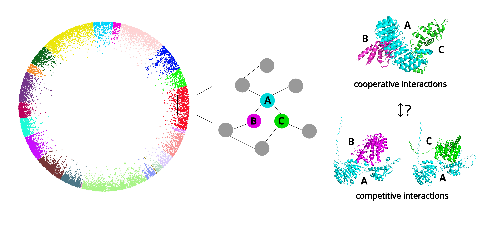

**Supplementary Tables for**  
*"Unraveling cooperative and competitive interactions within protein triplets in the human interactome"*
---

  

*Schematic representation of the study hypothesis.*

---
This study focuses on modeling protein–protein interactions within the human interactome, using hyperbolic network embeddings and machine learning to distinguish cooperative from competitive triplet configurations.

---

## 📁 Contents

- **`Supplementary_Table_S1.csv`**: Node-level features of proteins in the human protein interaction network.
- **`Supplementary_Table_S2.csv`**: Edge-level features between protein pairs in the human protein interaction network.
- **`Supplementary_Table_S3.csv`**: Structurally supported triplet annotations from Interactome3D.
- **`Supplementary_Table_S4.csv`**: Feature matrix for triplet classification.
- **`Supplementary_Table_S5.csv`**: Predicted cooperative or competitive protein triplet interactions with model scores.
- **`Supplementary_Table_S6.csv`**: Filtered triplet predictions by score quantile (low-degree proteins).

---
> 📦 **Note:** This repository uses [Git Large File Storage (LFS)](https://git-lfs.github.com/) for some supplementary files.
> To clone the repository with large files included, install Git LFS and run:
> `git lfs install && git clone https://github.com/avagiona/Cooperative-Competitive-interactions-within-protein-triplets.git`

