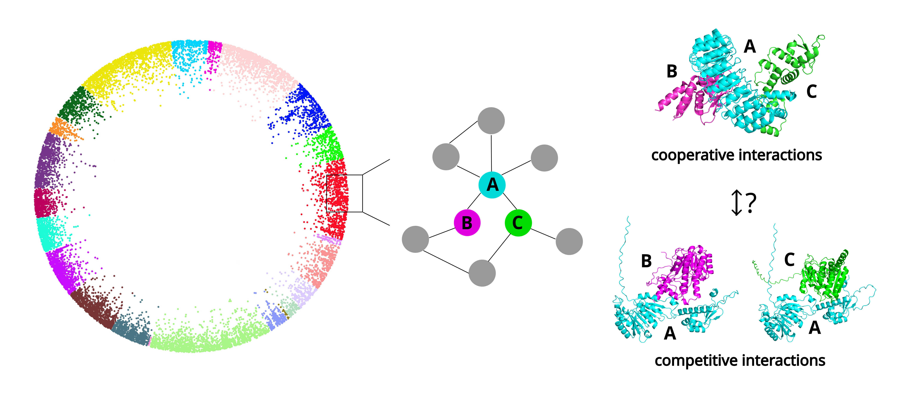

**Supplementary Tables for**  
*"Unraveling cooperative and competitive interactions within protein triplets in the human interactome"*
---

  

*Schematic representation of the study hypothesis.*

---
This study focuses on modeling protein–protein interactions within the human interactome, using hyperbolic network embeddings and machine learning to distinguish cooperative from competitive triplet configurations.

---

## 📁 Contents

- **`Supplementary_Table_S1.csv`**: Nodes of the hPIN. Columns indicate protein identifiers (UniProtKB), hyperbolic coordinates (r, theta), centrality measures (Degree Centrality—DC, Closeness Centrality—CC, Betweenness Centrality—BC, and Eigenvector Centrality—EC), intrinsic disorder region presence (idr; yes=1, no=0) and subcellular localization (nucleus, cytoplasm, endomembrane, multi-localized proteins).
- **`Supplementary_Table_S2.csv`**: Edges of the hPIN. Columns indicate protein identifiers (UniProtKB; V1, V2), hyperbolic distance (hd), r difference (rd) and angular difference (thetad) derived from the hyperbolic embedding.
- **`Supplementary_Table_S3.csv`**: Structurally supported protein triplets annotated using Interactome3D. Columns indicate the triplet identifier (Triplet_ID), associated PDB structure (PDB_ID), the common protein and its interactors (Common, V1, V2), and the regions of interaction between the common protein and each interactor (region_common_V1, region_common_V2), specifying the PDB chain and residues involved.
- **`Supplementary_Table_S4.zip`**: Predictions of cooperative and non-cooperative protein triplets with associated scores. Columns indicate whether structural evidence supports the interaction (cooperative: 1 for structurally validated, 0 otherwise), the protein identifiers (common, V1, V2), and the classification scores assigned by the predictive model for each class (score_competitive and score_cooperative).
- **`Supplementary_Table_S5.zip`**: Predictions of cooperative and competitive protein triplets based on low-degree proteins (DC≤10) triplets with structural validation and feature annotations. Columns include the validation label based on structural evidence (cooperative: 1 for structurally validated, 0 otherwise), protein identifiers (common, V1, V2), angular difference between V1 and V2 in hyperbolic space (thetad_V1_V2), degree centralities of each protein (degree_common, degree_V1, degree_V2), prediction scores (score_competitive and score_cooperative)), quantile (quantile)and presence of paralogous relationships (paralog).
- **`Triplet_Feature_Matrix_ML.zip`**: Feature matrix used for the classification of cooperative versus non-cooperative protein triplets. Each row represents a protein triplet, including the triplet type (cooperative or not), the protein identifiers (common, V1, V2), and hyperbolic embedding-based features (r, theta, hyperbolic distance—hd, radial distance—rd, angular difference—theta_d) for all proteins and their pairwise combinations. Node-level features (degree, closeness, betweenness, eigenvector centralities), intrinsic disorder region information (idr), and subcellular localization (nucleus, cytoplasm, endomembrane, multi-localized) are provided for each protein individually (common, V1, and V2).

---
> 📦 **Note:** This repository uses [Git Large File Storage (LFS)](https://git-lfs.github.com/) for some supplementary files.
> To clone the repository with large files included, install Git LFS and run:
> `git lfs install && git clone https://github.com/avagiona/Cooperative-Competitive-interactions-within-protein-triplets.git`

